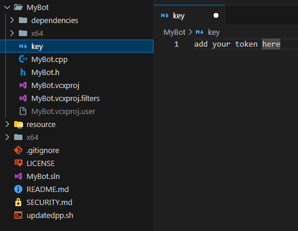
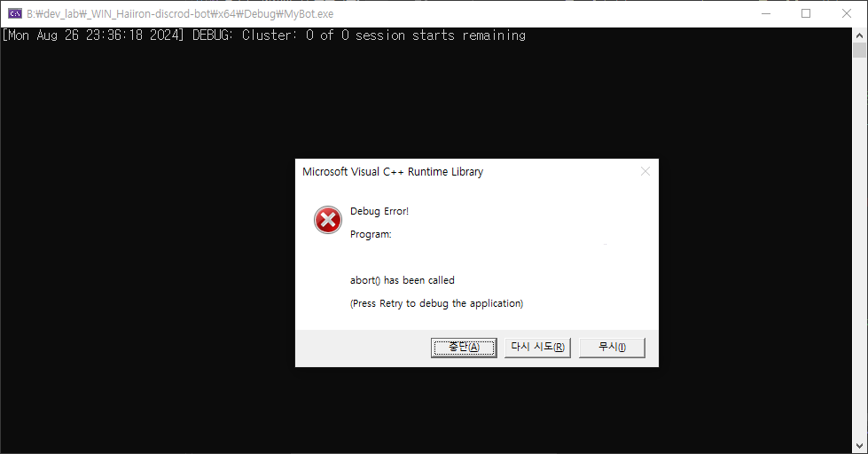

# 윈도우 운영체제 Discord 봇 프로젝트 (D++)

[D++](https://github.com/brainboxdotcc/DPP) Discord 봇 템플릿은 Visual Studio 2022 (x64 and x86, release and debug)에서 작동합니다. 본 레포지토리는 올바른 아키텍처를 자동적으로 선택, build에서 올바른 폴더에 DLL 파일을 복사하기 위한 추가적인 향상된 기능을 갖춘 [튜토리얼](https://dpp.dev/build-a-discord-bot-windows-visual-studio.html)입니다.

[이 템플릿](https://github.com/HarryKito/_WIN_Haiiron-discrod-bot)은 CI의 최신 D++ 마스터 브랜치와 함께 제공되며, 본 프로젝트를 사용하시려면 MyBot.cpp에 코드를 입력하고 실행하면 됩니다.

지원 및 지원은 [공식 지원 디스코드](https://discord.gg/dpp)에 참여해 주시기 바랍니다.

## [이 프로젝트](https://github.com/HarryKito/_WIN_Haiiron-discrod-bot) 사용법

키 값을 저장하는 파일 __(key)__ 에 저장하여 사용하면 된다.
  
### 만약 키값이 없다면 아래와 같은 에러를 일으킴.
